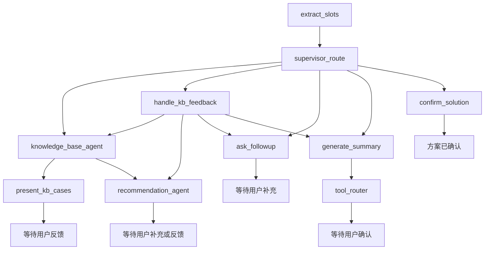

<!-- cSpell:words agent_solution cSpell conda embeddings FastAPI FTS5 GreatRouter GREATEROUTE GREATROUTER langchain langgraph langsmith langgra Pydantic pyproject pytest SQLite venv VLLM -->

# Agent Solution

这是一个以 LangGraph 为核心的多智能体算法方案确认 Agent MVP。系统支持用户输入算法业务需求，由 Supervisor 编排知识库 Agent 和方案推荐 Agent，通过历史案例检索、用户满意度确认、方案推荐和多轮需求补全，最终生成可确认的算法方案总结。

当前版本不引入 FastAPI，先以 Python package + CLI 的方式验证核心 Agent 流程。后续需要服务化时，可以在现有核心模块外层再封装 HTTP API。

## 核心能力

- 使用 LangGraph 编排多轮算法方案确认流程。
- 使用 Supervisor 模式编排知识库 Agent 和方案推荐 Agent。
- 知识库 Agent 将检索命中整理为可读的历史案例摘要，并显式询问用户是否满意。
- 当历史案例未命中或用户不满意时，方案推荐 Agent 推荐一个最佳算法方案。
- 方案推荐 Agent 会先收集输入、输出、约束和验收指标，需求充分后才生成核心算法路线。
- 支持 GreatRouter/OpenAI-compatible chat 和 embeddings 接口。
- 使用 SQLite 保存知识库文档、切片和向量。
- 使用 SQLite FTS5 做关键词检索。
- 使用 `text-embedding-3-small` embeddings 做向量相似度检索。
- 支持 hybrid 检索，融合关键词分数和向量相似度。
- 内置中文算法流程种子知识库，包括抽烟识别、安全帽识别、跌倒检测、区域入侵、明火烟雾检测。
- 预留工具注册表，后续可扩展本地 tool 或 MCP tool。

## LangGraph 节点说明

当前图采用 Supervisor 多智能体编排模式。用户每次发送自然语言消息后，都会从 `extract_slots` 进入图，由 `supervisor_route` 根据当前阶段决定交给知识库 Agent、方案推荐 Agent，还是进入方案确认流程。



| 节点 | 归属 | 主要职责 | 关键状态变化与下一步 |
| --- | --- | --- | --- |
| `extract_slots` | 共享能力 | 从最近多轮用户消息中抽取算法目标、输入、输出、核心流程、约束、评估指标、假设和边界场景，并与已有槽位合并。 | 更新 `slots`、`missing_required_slots`、`missing_optional_slots`，随后进入 `supervisor_route`。 |
| `supervisor_route` | Supervisor | 根据当前 `stage`、知识库命中情况、用户满意度和方案确认状态决定下一步由哪个 Agent 处理。 | 设置 `active_agent=supervisor`，路由到知识库检索、反馈处理、推荐、追问、总结或确认节点。 |
| `knowledge_base_agent` | KnowledgeBaseAgent | 根据用户需求和已知槽位执行 hybrid 检索，并把原始检索结果整理成 1-3 个可读的历史案例摘要。 | 更新 `kb_context`、`kb_cases`、`kb_has_match`；有可用案例时进入 `present_kb_cases`，否则进入 `recommendation_agent`。 |
| `present_kb_cases` | KnowledgeBaseAgent | 向用户展示历史案例摘要，并明确询问这些案例是否满足需求。 | 将 `stage` 设置为 `kb_satisfaction_check`，结束当前轮并等待用户回答。 |
| `handle_kb_feedback` | Supervisor | 判断用户对历史案例是满意、不满意，还是在继续补充需求。 | 满意后进入方案细化；不满意时进入推荐 Agent；继续补充时重新检索知识库。 |
| `recommendation_agent` | RecommendationAgent | 当历史案例不满足需求时，先检查推荐所需信息是否充分；不足时只询问一个关键需求，充分后推荐一个最佳算法方案。 | 推荐完成后写入 `recommended_solution`，并把推荐的核心技术路线补入 `slots.core_steps`。 |
| `ask_followup` | Supervisor | 在方案细化阶段，针对尚未补齐的核心槽位进行“先确认已记录信息，再单轮追问一个问题”的补充确认。 | 保持 `stage=solution_refinement`，结束当前轮并等待用户补充。 |
| `generate_summary` | Supervisor | 汇总用户需求、知识库案例和推荐方案，生成正式 Markdown 方案总结及内部 JSON。 | 更新 `draft_summary_markdown`、`draft_solution_json`，将状态切换为 `reviewing`，随后进入 `tool_router`。 |
| `tool_router` | 工具扩展点 | 在方案总结后调用已注册工具；当前会根据核心流程调用复杂度估算工具，后续可在此接入更多 Tool 或 MCP。 | 将工具结果写入 `draft_solution_json.tool_estimates`，结束当前轮并等待用户确认。 |
| `confirm_solution` | Supervisor | 在用户对待确认方案回复“确认”或“同意”后完成最终确认。 | 将 `stage` 和 `status` 设置为 `confirmed`。 |

### 条件路由函数

条件路由函数不是独立 Agent，也不会直接回复用户，它们只负责根据状态选择图中的下一条边：

- `supervisor_decision`：选择知识库检索、反馈处理、方案推荐、需求追问、方案总结或最终确认。
- `knowledge_result_decision`：判断知识库 Agent 是否找到了可展示的历史案例。
- `feedback_decision`：根据用户对历史案例的满意度选择重新检索、进入推荐或继续方案确认。

### 关键状态字段

- `stage`：表示多智能体链路当前所处阶段，例如 `kb_retrieval`、`recommendation`、`solution_refinement`、`reviewing`。
- `active_agent`：表示当前负责处理的 Agent，例如 `supervisor`、`knowledge_base_agent`、`recommendation_agent`。
- `status`：只表示最终方案状态，取值为 `collecting`、`reviewing`、`confirmed`。
- `slots`：保存从用户自然语言中逐轮提取并合并的算法需求。
- `kb_context`：保存底层知识库检索结果；`kb_cases` 保存面向用户展示的案例摘要。
- `recommended_solution`：保存方案推荐 Agent 生成的最佳方案。
- `messages`：LangGraph Studio Chat 使用的标准消息列表。

## 项目结构

```text
.
├── README.md
├── cspell.json
├── pyproject.toml
├── langgraph.json
├── .gitignore
├── scripts/
│   └── langgraph_dev.sh
├── src/
│   └── agent_solution/
│       ├── __init__.py
│       ├── cli.py
│       ├── config.py
│       ├── graph.py
│       ├── langgraph_app.py
│       ├── kb.py
│       ├── llm.py
│       ├── models.py
│       ├── prompts/
│       │   ├── __init__.py
│       │   ├── extract_slots.md
│       │   ├── ask_followup.md
│       │   ├── generate_summary.md
│       │   ├── knowledge_base_agent.md
│       │   ├── kb_satisfaction_check.md
│       │   ├── recommendation_followup.md
│       │   └── recommendation_agent.md
│       ├── simulation.py
│       ├── tools.py
│       └── knowledge_base/
│           └── seeds/
│               ├── smoking_detection.md
│               ├── helmet_detection.md
│               ├── fall_detection.md
│               ├── intrusion_detection.md
│               └── fire_smoke_detection.md
└── tests/
    ├── test_graph.py
    ├── test_kb.py
    ├── test_langgraph_app.py
    ├── test_simulation.py
    └── test_tools.py
```

## 文件说明

### 根目录

- `README.md`：项目说明文档，介绍项目能力、结构、安装方式和 CLI 使用方式。
- `cspell.json`：VS Code cSpell 拼写检查词表配置，避免技术名词被标记为 Unknown word。
- `pyproject.toml`：Python 项目配置文件，声明包名、版本、依赖、可选测试依赖和 `agent-solution` 命令入口。
- `langgraph.json`：官方 LangGraph CLI 配置文件，声明 `langgraph dev` 要加载的 graph 入口和默认仿真环境变量。
- `.gitignore`：忽略本地运行生成的数据库、虚拟环境、Python 缓存和 pytest 缓存。
- `scripts/langgraph_dev.sh`：一键启动 LangGraph dev server 的脚本，会自动切换到项目根目录并使用 `agent-solution-langgraph` conda 环境。

### 核心代码

- `src/agent_solution/__init__.py`：包初始化文件，定义项目版本。
- `src/agent_solution/cli.py`：命令行入口，提供 `chat`、`kb seed`、`kb add`、`kb search`、`tools list` 等命令。
- `src/agent_solution/config.py`：配置读取模块，从环境变量读取数据库路径、GreatRouter/OpenAI-compatible 地址、模型名称、API Key 和知识库切片参数。
- `src/agent_solution/graph.py`：LangGraph 多智能体核心流程，负责 Supervisor 阶段路由、知识库 Agent、方案推荐 Agent、槽位补全、方案总结、方案确认和工具路由。
- `src/agent_solution/langgraph_app.py`：官方 LangGraph CLI 的 graph 导出入口，根据 `AGENT_SOLUTION_SIMULATE` 选择真实或仿真模型，并自动导入种子知识库。
- `src/agent_solution/kb.py`：知识库模块，负责 Markdown/TXT 导入、文本切片、SQLite/FTS5 存储、关键词检索、向量检索和 hybrid 检索。
- `src/agent_solution/llm.py`：OpenAI-compatible 客户端，默认按 GreatRouter 地址调用 chat completions 和 embeddings。
- `src/agent_solution/models.py`：Pydantic 数据模型，定义算法方案槽位、历史案例摘要、推荐方案、消息、知识库命中结果、工具调用记录和多智能体状态。
- `src/agent_solution/prompts/`：Agent prompt 目录，`__init__.py` 负责加载包内 Markdown prompt，包含槽位抽取、知识库案例整理、满意度询问、推荐需求追问、方案推荐、方案细化追问和方案总结 prompt。
- `src/agent_solution/simulation.py`：无模型仿真模块，提供 `SimulatedLLMClient` 和抽烟识别预设对话，用于在真实模型不可用时跑通完整流程。
- `src/agent_solution/tools.py`：工具注册表，当前内置示例工具 `estimate_complexity`，用于粗略评估算法方案复杂度。

### 种子知识库

- `src/agent_solution/knowledge_base/seeds/smoking_detection.md`：抽烟识别算法流程，包含手-口动作、香烟/烟雾辅助、多帧融合、误报场景和评估指标。
- `src/agent_solution/knowledge_base/seeds/helmet_detection.md`：安全帽佩戴识别算法流程。
- `src/agent_solution/knowledge_base/seeds/fall_detection.md`：跌倒检测算法流程。
- `src/agent_solution/knowledge_base/seeds/intrusion_detection.md`：区域入侵检测算法流程。
- `src/agent_solution/knowledge_base/seeds/fire_smoke_detection.md`：明火烟雾检测算法流程。

这些文档可以通过 `agent-solution kb seed` 一次性导入 SQLite，作为本地知识库的初始内容。

### 测试

- `tests/test_graph.py`：测试 LangGraph 多智能体路由、槽位合并、知识库反馈、方案推荐、方案总结和工具路由结果。
- `tests/test_kb.py`：测试知识库切片、中文关键词检索、hybrid 检索和不支持文件格式的处理。
- `tests/test_langgraph_app.py`：测试官方 LangGraph CLI graph 入口可以被导入并执行。
- `tests/test_simulation.py`：测试无模型仿真客户端、仿真向量检索和抽烟识别 demo 的完整确认流程。
- `tests/test_tools.py`：测试默认工具注册表和复杂度评估工具。

## 安装

推荐使用独立 conda 环境，后续运行本项目都先激活该环境：

```bash
conda create -n agent-solution-langgraph python=3.12 -y
conda activate agent-solution-langgraph
pip install -e ".[dev,cli]"
```

也可以使用普通虚拟环境：

```bash
python -m venv .venv
source .venv/bin/activate
pip install -e ".[dev,cli]"
```

## 配置 GreatRouter

```bash
export GREATROUTER_BASE_URL="https://endpoint.greatrouter.com"
export GREATROUTER_CHAT_MODEL="gpt-5.4-nano"
export GREATROUTER_EMBED_MODEL="text-embedding-3-small"
export GREATROUTER_API_KEY="你的 API Key"
```

如果你习惯使用 `GREATEROUTE_*` 这个拼写，项目也兼容：

```bash
export GREATEROUTE_API_KEY="你的 API Key"
```

旧的 `VLLM_*` 环境变量仍作为兜底兼容，但后续推荐使用 `GREATROUTER_*`。

默认数据库路径为 `.agent_solution/agent_solution.sqlite`。可以通过下面的环境变量修改：

```bash
export AGENT_SOLUTION_DB="/path/to/agent_solution.sqlite"
```

## CLI 使用

### 无模型仿真运行

当前如果真实模型还不能使用，可以先用仿真模式跑通完整流程。仿真模式不会访问真实模型服务，而是使用本地 deterministic 模拟客户端返回固定的槽位抽取、追问、方案总结和向量结果。

手动进入仿真对话：

```bash
agent-solution chat --simulate
```

一键运行抽烟识别预设对话：

```bash
agent-solution demo smoking
```

`chat --simulate` 适合你自己输入不同算法需求测试流程；`demo smoking` 会自动导入种子知识库，并按预设对话完整演示“知识库案例检索 -> 用户不满意 -> 推荐 Agent 需求补全 -> 方案推荐 -> 最终确认”的多智能体流程。

### 常规命令

导入内置种子知识库：

```bash
agent-solution kb seed
```

搜索知识库：

```bash
agent-solution kb search "抽烟识别 手口动作 烟雾误报"
```

启动多轮对话：

```bash
agent-solution chat
```

查看当前注册的工具：

```bash
agent-solution tools list
```

## LangGraph CLI 运行

项目已经提供 `langgraph.json`，可以用官方 LangGraph CLI 启动本地开发服务：

```bash
conda activate agent-solution-langgraph
langgraph --help
langgraph dev --config langgraph.json --no-browser
```

如果 VS Code 当前终端不在项目目录，推荐直接使用脚本启动：

```bash
bash /Users/wangxinda/Documents/agent_solution/scripts/langgraph_dev.sh
```

默认配置 `AGENT_SOLUTION_SIMULATE=false`，因此 `langgraph dev` 会访问配置好的真实模型 API。启动前先配置 key：

```bash
export GREATROUTER_API_KEY="你的 API Key"
langgraph dev --config langgraph.json --no-browser
```

如果临时想回到本地仿真模式，可以把 `langgraph.json` 中的 `AGENT_SOLUTION_SIMULATE` 改为 `true`，或继续使用：

```bash
agent-solution chat --simulate
agent-solution demo smoking
```

## 测试

```bash
pytest -q
```
