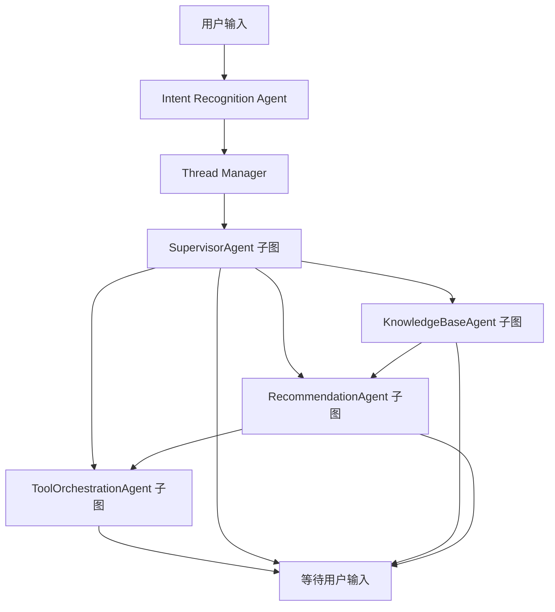

<!-- cSpell:words agent_solution cSpell conda embeddings FastAPI FTS5 GreatRouter GREATEROUTE GREATROUTER langchain langgraph langsmith langgra Pydantic pyproject pytest SQLite venv VLLM -->

# Agent Solution

这是一个以 LangGraph 为核心的多智能体算法应用推荐系统。系统支持一个用户围绕多个算法应用持续对话，由图外 Intent Recognition Agent 和 Thread Manager 自动切换应用级 thread，再由图内 Supervisor 编排知识库 Agent、方案推荐 Agent、方案确认流程和确认后的工具编排链路。

当前版本不引入 FastAPI，先以 Python package + CLI 的方式验证核心 Agent 流程。后续需要服务化时，可以在现有核心模块外层再封装 HTTP API。

## 核心能力

- 使用 LangGraph 编排多轮算法方案确认流程。
- 使用 Supervisor 模式编排知识库 Agent 和方案推荐 Agent。
- 使用独立 Intent Recognition Agent 图判断继续当前应用或切换新应用。
- 一个算法应用对应一个 LangGraph thread，用户画像可以跨 thread 共享，应用槽位保持隔离。
- 知识库 Agent 将检索命中整理为可读的历史案例摘要，并显式询问用户是否满意。
- 当历史案例未命中或用户不满意时，方案推荐 Agent 推荐一个最佳算法方案。
- 方案推荐 Agent 会先收集输入、输出、约束和验收指标，需求充分后才生成核心算法路线。
- AlgorithmPlanner 支持仿真模式和 GreatRouter 模型模式，生成结构化实施方案。
- 用户确认方案后，会将推荐方案或总结内容压缩成一句精确描述，并进入工具编排子图。
- 工具编排子图目前提供工具召回、工具选择、拓扑编排、参数生成和后处理的占位链路，后续可接真实检索服务和 Agent。
- 使用 SQLite 保存用户画像、应用会话、业务状态快照和行为历史。
- 支持 rolling summary，避免单个应用会话的消息无限增长。
- 支持 GreatRouter/OpenAI-compatible chat 和 embeddings 接口。
- 使用 SQLite 保存知识库文档、切片和向量。
- 使用 SQLite FTS5 做关键词检索。
- 使用 `text-embedding-3-small` embeddings 做向量相似度检索。
- 支持 hybrid 检索，融合关键词分数和向量相似度。
- 内置中文算法流程种子知识库，包括抽烟识别、安全帽识别、跌倒检测、区域入侵、明火烟雾检测。
- 预留工具注册表，后续可扩展本地 tool 或 MCP tool。

## LangGraph 节点说明

系统采用两层图。图外 `intent_router` 先识别用户意图，`AgentSolutionService` 和 Thread Manager 再选择目标 thread；应用主图展示四个 Agent 子图，由 SupervisorAgent 委派 KnowledgeBaseAgent、RecommendationAgent，并在用户确认方案后进入 ToolOrchestrationAgent。



### 顶层 Agent 子图

| Agent 子图 | 主要职责 | 内部节点 |
| --- | --- | --- |
| `supervisor_agent` | 槽位抽取、阶段路由、案例反馈处理、方案细化、总结、工具调用和最终确认。 | `extract_slots`、`supervisor_route`、`handle_kb_feedback`、`ask_followup`、`generate_summary`、`tool_router`、`confirm_solution` |
| `knowledge_base_agent` | 执行 hybrid 检索、整理历史案例摘要并向用户展示。 | `retrieve_knowledge`、`summarize_knowledge_cases`、`present_kb_cases` |
| `recommendation_agent` | 检查推荐需求、调用 AlgorithmPlanner、标准化并展示实施方案。 | `check_recommendation_requirements`、`recommendation_followup`、`build_algorithm_plan_request`、`algorithm_plan_api_tool`、`normalize_algorithm_plan`、`present_recommendation` |
| `tool_orchestration_agent` | 在方案确认后接收一句方案描述，按单向链路执行工具召回、工具选择、拓扑编排、参数生成和后处理。 | `tool_recall_node`、`planning_agent`、`topology_agent`、`parameter_agent`、`judge_agent` |

独立的 `intent_router` 图只包含 `intent_recognition_agent`。它不使用应用 thread checkpoint，因此可以在槽位抽取之前判断是否需要创建新应用 thread。

当前版本暂不支持应用对比和泛推荐。这类输入会返回澄清提示，引导用户选择一个具体算法应用。

### 关键状态字段

- `stage`：表示多智能体链路当前所处阶段，例如 `kb_retrieval`、`recommendation`、`solution_refinement`、`reviewing`、`tool_orchestration`。
- `active_agent`：表示当前负责处理的 Agent，例如 `supervisor`、`knowledge_base_agent`、`recommendation_agent`、`tool_orchestration_agent`。
- `status`：只表示最终方案状态，取值为 `collecting`、`reviewing`、`confirmed`。
- `slots`：保存从用户自然语言中逐轮提取并合并的算法需求。
- `kb_context`：保存底层知识库检索结果；`kb_cases` 保存面向用户展示的案例摘要。
- `recommended_solution`：保存方案推荐 Agent 生成的最佳方案。
- `algorithm_main_description`：保存传入工具编排子图的一句话方案描述，优先来自推荐方案，其次来自槽位或总结内容。
- `tool_recall_result`、`selected_tools`、`tool_topology`、`tool_parameters`、`orchestration_judgement`：保存工具编排子图各阶段的占位结果。
- `next_agent`：父图下一步应委派的 Agent。
- `turn_complete`：当前轮是否已经生成用户可见回复。
- `messages`：LangGraph Studio Chat 使用的标准消息列表。

## 项目结构

```text
.
├── README.md
├── cspell.json
├── pyproject.toml
├── requirement.txt
├── langgraph.json
├── .gitignore
├── scripts/
│   └── langgraph_dev.sh
├── src/
│   └── agent_solution/
│       ├── __init__.py
│       ├── algorithm_planner.py
│       ├── app_router.py
│       ├── agents/
│       │   ├── __init__.py
│       │   ├── intent_recognition.py
│       │   ├── knowledge_base.py
│       │   ├── recommendation.py
│       │   ├── supervisor.py
│       │   └── tool_orchestration.py
│       ├── cli.py
│       ├── config.py
│       ├── graph.py
│       ├── graph_state.py
│       ├── langgraph_app.py
│       ├── kb.py
│       ├── llm.py
│       ├── models.py
│       ├── service.py
│       ├── storage.py
│       ├── thread_manager.py
│       ├── prompts/
│       │   ├── __init__.py
│       │   ├── algorithm_plan.md
│       │   ├── extract_slots.md
│       │   ├── intent_recognition.md
│       │   ├── ask_followup.md
│       │   ├── generate_summary.md
│       │   ├── knowledge_base_agent.md
│       │   ├── kb_satisfaction_check.md
│       │   ├── recommendation_followup.md
│       │   ├── recommendation_agent.md
│       │   └── user_profile_extract.md
│       ├── simulation.py
│       ├── tools.py
│       └── knowledge_base/
│           └── seeds/
│               ├── smoking_detection.md
│               ├── helmet_detection.md
│               ├── fall_detection.md
│               ├── intrusion_detection.md
│               └── fire_smoke_detection.md
└── tests/
    ├── test_graph.py
    ├── test_algorithm_planner.py
    ├── test_app_router.py
    ├── test_kb.py
    ├── test_langgraph_app.py
    ├── test_simulation.py
    ├── test_service.py
    └── test_tools.py
```

## 文件说明

### 根目录

- `README.md`：项目说明文档，介绍项目能力、结构、安装方式和 CLI 使用方式。
- `cspell.json`：VS Code cSpell 拼写检查词表配置，避免技术名词被标记为 Unknown word。
- `pyproject.toml`：Python 项目配置文件，声明包名、版本、依赖、可选测试依赖和 `agent-solution` 命令入口。
- `requirement.txt`：pip requirements 文件，汇总运行、测试和 LangGraph CLI 所需依赖，适合不使用 `pyproject.toml` extras 的环境。
- `langgraph.json`：官方 LangGraph CLI 配置文件，声明 `langgraph dev` 要加载的 graph 入口和默认仿真环境变量。
- `.gitignore`：忽略本地运行生成的数据库、虚拟环境、Python 缓存和 pytest 缓存。
- `scripts/langgraph_dev.sh`：一键启动 LangGraph dev server 的脚本，会自动切换到项目根目录并使用 `agent-solution-langgraph` conda 环境。

### 核心代码

- `src/agent_solution/__init__.py`：包初始化文件，定义项目版本。
- `src/agent_solution/algorithm_planner.py`：实施方案生成接口，提供 deterministic 仿真 Planner 和 GreatRouter 模型 Planner。
- `src/agent_solution/app_router.py`：Intent Recognition Agent 的结构化识别逻辑和规则兜底。
- `src/agent_solution/agents/`：LangGraph Agent 子图构造器，分别定义 Intent、Supervisor、知识库、推荐和工具编排 Agent 的可视化边界。
- `src/agent_solution/cli.py`：命令行入口，提供 `chat`、`kb seed`、`kb add`、`kb search`、`tools list` 等命令。
- `src/agent_solution/config.py`：配置读取模块，从环境变量读取数据库路径、GreatRouter/OpenAI-compatible 地址、模型名称、API Key 和知识库切片参数。
- `src/agent_solution/graph.py`：LangGraph 父图和公共构造入口，顶层编排 Supervisor、知识库、推荐和工具编排 Agent 子图。
- `src/agent_solution/graph_state.py`：父图与子图共享的 GraphState、消息转换和节点适配器。
- `src/agent_solution/langgraph_app.py`：官方 LangGraph CLI 的 graph 导出入口，根据 `AGENT_SOLUTION_SIMULATE` 选择真实或仿真模型，并自动导入种子知识库。
- `src/agent_solution/kb.py`：知识库模块，负责 Markdown/TXT 导入、文本切片、SQLite/FTS5 存储、关键词检索、向量检索和 hybrid 检索。
- `src/agent_solution/llm.py`：OpenAI-compatible 客户端，默认按 GreatRouter 地址调用 chat completions 和 embeddings。
- `src/agent_solution/models.py`：Pydantic 数据模型，定义算法方案槽位、历史案例摘要、推荐方案、消息、知识库命中结果、工具调用记录、工具编排占位结果和多智能体状态。
- `src/agent_solution/service.py`：统一聊天服务，负责意图识别、thread 选择、图调用、状态快照和长对话压缩。
- `src/agent_solution/storage.py`：业务 SQLite 存储，保存用户画像、应用会话、会话状态快照和行为历史。
- `src/agent_solution/thread_manager.py`：根据意图结果创建、复用和恢复算法应用 thread。
- `src/agent_solution/prompts/`：Agent prompt 目录，`__init__.py` 负责加载包内 Markdown prompt，包含槽位抽取、知识库案例整理、满意度询问、推荐需求追问、方案推荐、方案细化追问和方案总结 prompt。
- `src/agent_solution/simulation.py`：无模型仿真模块，提供 `SimulatedLLMClient` 和抽烟识别预设对话，用于在真实模型不可用时跑通完整流程。
- `src/agent_solution/tools.py`：工具注册表，当前内置示例工具 `estimate_complexity`，用于粗略评估算法方案复杂度。
- `src/agent_solution/agents/tool_orchestration.py`：确认方案后的工具编排子图，当前按单向链路保留工具召回、Planning、Topology、Parameter 和 Judge 节点占位。

### 种子知识库

- `src/agent_solution/knowledge_base/seeds/smoking_detection.md`：抽烟识别算法流程，包含手-口动作、香烟/烟雾辅助、多帧融合、误报场景和评估指标。
- `src/agent_solution/knowledge_base/seeds/helmet_detection.md`：安全帽佩戴识别算法流程。
- `src/agent_solution/knowledge_base/seeds/fall_detection.md`：跌倒检测算法流程。
- `src/agent_solution/knowledge_base/seeds/intrusion_detection.md`：区域入侵检测算法流程。
- `src/agent_solution/knowledge_base/seeds/fire_smoke_detection.md`：明火烟雾检测算法流程。

这些文档可以通过 `agent-solution kb seed` 一次性导入 SQLite，作为本地知识库的初始内容。

### 测试

- `tests/test_graph.py`：测试 LangGraph 多智能体路由、槽位合并、知识库反馈、方案推荐、方案总结、工具路由和确认后的工具编排结果。
- `tests/test_app_router.py`：测试应用级意图识别和应用切换规则。
- `tests/test_algorithm_planner.py`：测试仿真实施方案生成和模型异常降级。
- `tests/test_kb.py`：测试知识库切片、中文关键词检索、hybrid 检索和不支持文件格式的处理。
- `tests/test_langgraph_app.py`：测试官方 LangGraph CLI graph 入口可以被导入执行，并验证顶层 Agent 子图可在 Studio 展开。
- `tests/test_simulation.py`：测试无模型仿真客户端、仿真向量检索和抽烟识别 demo 的完整确认流程。
- `tests/test_service.py`：测试多应用 thread 隔离、SQLite 恢复、特殊会话、用户画像和 rolling summary。
- `tests/test_tools.py`：测试默认工具注册表和复杂度评估工具。

## 安装

推荐使用独立 conda 环境，后续运行本项目都先激活该环境：

```bash
conda create -n agent-solution-langgraph python=3.12 -y
conda activate agent-solution-langgraph
pip install -e ".[dev,cli]"
```

也可以使用普通虚拟环境：

```bash
python -m venv .venv
source .venv/bin/activate
pip install -e ".[dev,cli]"
```

如果只想按 requirements 安装依赖，可以使用：

```bash
pip install -r requirement.txt
pip install -e .
```

## 配置 GreatRouter

```bash
export GREATROUTER_BASE_URL="https://endpoint.greatrouter.com"
export GREATROUTER_CHAT_MODEL="gpt-5.4-nano"
export GREATROUTER_EMBED_MODEL="text-embedding-3-small"
export GREATROUTER_API_KEY="你的 API Key"
```

如果你习惯使用 `GREATEROUTE_*` 这个拼写，项目也兼容：

```bash
export GREATEROUTE_API_KEY="你的 API Key"
```

旧的 `VLLM_*` 环境变量仍作为兜底兼容，但后续推荐使用 `GREATROUTER_*`。

默认数据库路径为 `.agent_solution/agent_solution.sqlite`。可以通过下面的环境变量修改：

```bash
export AGENT_SOLUTION_DB="/path/to/agent_solution.sqlite"
```

LangGraph thread checkpoint 默认保存到 `.agent_solution/checkpoints.sqlite`：

```bash
export AGENT_SOLUTION_CHECKPOINT_DB="/path/to/checkpoints.sqlite"
```

实施方案生成默认使用仿真 Planner，不访问模型。切换到 GreatRouter 模型 Planner：

```bash
export AGENT_SOLUTION_PLAN_MODE="model"
```

## CLI 使用

### 无模型仿真运行

当前如果真实模型还不能使用，可以先用仿真模式跑通完整流程。仿真模式不会访问真实模型服务，而是使用本地 deterministic 模拟客户端返回固定的槽位抽取、追问、方案总结和向量结果。

手动进入仿真对话：

```bash
agent-solution chat --simulate
```

一键运行抽烟识别预设对话：

```bash
agent-solution demo smoking
```

`chat --simulate` 适合你自己输入不同算法需求测试流程；`demo smoking` 会自动导入种子知识库，并按预设对话完整演示“知识库案例检索 -> 用户不满意 -> 推荐 Agent 需求补全 -> 方案推荐 -> 最终确认”的多智能体流程。

### 常规命令

导入内置种子知识库：

```bash
agent-solution kb seed
```

搜索知识库：

```bash
agent-solution kb search "抽烟识别 手口动作 烟雾误报"
```

启动多轮对话：

```bash
agent-solution chat --user-id u_001
```

恢复已有应用会话：

```bash
agent-solution chat --user-id u_001 --thread-id u_001__smoking_detection__20260603_001
```

聊天过程中可以使用：

```text
/sessions
/use <thread_id>
/exit
```

系统会在每轮回复前显示当前算法应用、阶段、状态和 thread_id。同一应用内的追问复用 thread，新算法应用会自动创建独立 thread。

查看当前注册的工具：

```bash
agent-solution tools list
```

## LangGraph CLI 运行

项目已经提供 `langgraph.json`，可以用官方 LangGraph CLI 启动本地开发服务：

```bash
conda activate agent-solution-langgraph
langgraph --help
langgraph dev --config langgraph.json --no-browser
```

LangGraph Studio 中有三个 graph：

- `intent_router`：独立观察意图识别 Agent，不加载应用 thread。
- `agent_solution`：观察应用主图，顶层显示 Supervisor、知识库、推荐和工具编排四个 Agent 子图。
- `agent_solution_chat`：使用 Chat 模式测试应用主图，并可展开查看 Agent 内部节点。

Thread Manager 的自动跨 thread 切换通过 `agent-solution chat` 验证；后续增加 FastAPI 和前端时可以直接复用 `AgentSolutionService`。

如果 VS Code 当前终端不在项目目录，推荐直接使用脚本启动：

```bash
bash /Users/wangxinda/Documents/agent_solution/scripts/langgraph_dev.sh
```

默认配置 `AGENT_SOLUTION_SIMULATE=false`，因此 `langgraph dev` 会访问配置好的真实模型 API。启动前先配置 key：

```bash
export GREATROUTER_API_KEY="你的 API Key"
langgraph dev --config langgraph.json --no-browser
```

如果临时想回到本地仿真模式，可以把 `langgraph.json` 中的 `AGENT_SOLUTION_SIMULATE` 改为 `true`，或继续使用：

```bash
agent-solution chat --simulate
agent-solution demo smoking
```

## 测试

```bash
pytest -q
```

如果系统默认 Python 没有安装 pytest，可以直接使用推荐 conda 环境：

```bash
/Users/wangxinda/miniconda3/envs/agent-solution-langgraph/bin/python -m pytest
```
